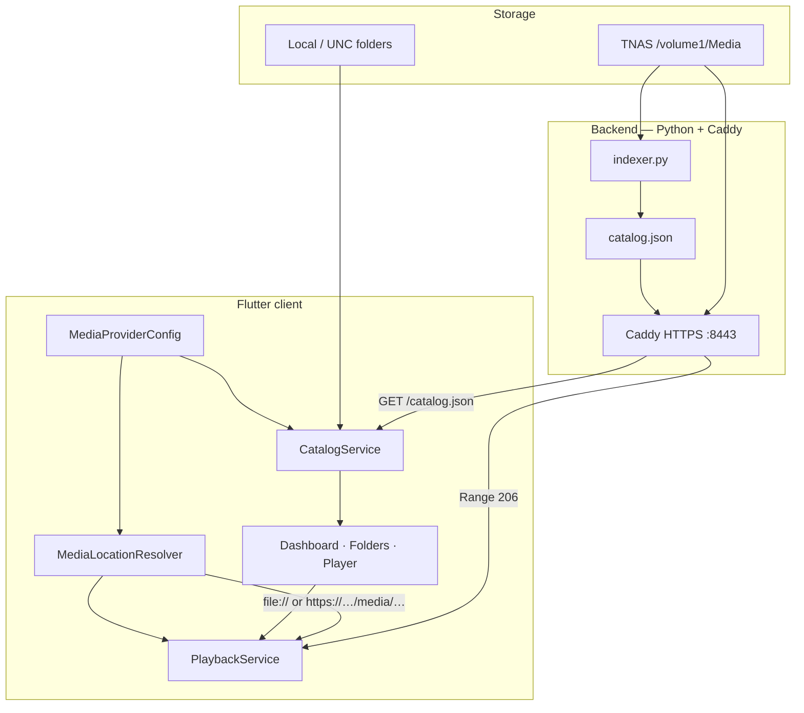

# TTSPlayer

A lightweight, **local-first** home media platform. Browse your own folder structure, play video from local paths or a NAS, and optionally stream over HTTPS — without Plex-style daemons, transcoding, or metadata scrapers.

**Current release line:** `v0.6.0` · **M5 complete** ([release summary](docs/release/m5-complete.md)) · tags [`v0.6.0`](https://github.com/TheTowerUK/TTSPlayer/releases/tag/v0.6.0) / [`m5-complete`](https://github.com/TheTowerUK/TTSPlayer/releases/tag/m5-complete)

---

## Project overview

TTSPlayer treats the **filesystem as the source of truth**. Your folder names are the categories; the Python indexer walks the tree and writes `catalog.json`; the Flutter client loads that catalogue and resolves each item to a playable URI (local file or HTTPS URL).

| Principle | What it means |
|---|---|
| **Folder-first** | No invented libraries — the catalogue mirrors your directories |
| **Local-first** | Works offline with a bundled demo catalogue or a local `catalog.json` |
| **Zero bloat** | No background indexer daemon; rescan on demand |
| **Provider-neutral** | Same app for mapped drives, UNC paths, and NAS + Caddy HTTPS |

**Platforms today:** Windows desktop (primary), Android-capable Flutter tree. iOS/tvOS are future targets.

**Validated deployment:** TerraMaster TNAS + Caddy on `:8443` — HTTPS catalogue, remote playback, HTTP Range (seeking), and trusted internal CA.

---

## Quick Start (5 minutes)

Run the client with the **bundled demo catalogue** — no NAS or indexer required.

```powershell
git clone https://github.com/TheTowerUK/TTSPlayer.git
cd TTSPlayer\client\ttsplayer
flutter pub get
flutter run -d windows
```

On first launch you can browse folders and play sample items immediately. Point at your own library later via **Settings** (see [Build instructions](#build-instructions)).

---

## Architecture



**Data flow (browse → play):**

1. **Indexer** scans supported video (and image) extensions under a root path → atomic write of `catalog.json`.
2. **CatalogService** loads catalogue from local file, configured HTTPS URL, or bundled demo.
3. **MediaLocationResolver** maps catalogue `file_path` values to `file://` (desktop) or `https://host/media/…` (remote mode).
4. **PlaybackService** streams via `media_kit` (Windows) or `video_player` (mobile).

Deep dives: [media access abstraction](docs/architecture/media-access-abstraction.md) · [path mapping](docs/architecture/path-mapping.md) · [deployment checklist](docs/deployment/tnas-caddy-deploy-checklist.md)

### Repository layout

```
TTSPlayer/
├── backend/                 # Python indexer, Caddy reference config
├── client/ttsplayer/        # Flutter application
├── docs/                    # Architecture, roadmap, deployment, release notes
├── assets/                  # Shared mock catalogue samples
└── .cursor/rules/           # AI / contributor guardrails
```

---

## Screenshots

Capture guides and filenames live in [`docs/screenshots/README.md`](docs/screenshots/README.md).

| Screen | File (add when captured) |
|---|---|
| Dashboard | `docs/screenshots/dashboard.png` |
| Folder browse | `docs/screenshots/folder-grid.png` |
| Video playback | `docs/screenshots/player.png` |
| Settings — media providers | `docs/screenshots/settings-providers.png` |

Once images are added, they render here automatically:

<!-- Uncomment when assets exist:


-->

---

## Build instructions

### Prerequisites

| Tool | Version / notes |
|---|---|
| [Flutter](https://docs.flutter.dev/get-started/install) | SDK ≥ 3.3 (see `client/ttsplayer/pubspec.yaml`) |
| Windows | Visual Studio workload for desktop; for `media_kit` video |
| Python | 3.12+ for the indexer (stdlib only) |
| Optional | [Caddy 2.x](https://caddyserver.com/) for NAS HTTPS serving |

### Flutter client (Windows)

```powershell
cd client\ttsplayer
flutter pub get
flutter analyze
flutter test
flutter run -d windows
```

On first launch the app uses the **bundled demo catalogue** (offline). Configure real sources via **Settings** (catalogue paths, HTTPS catalogue URL, media base URL, access mode).

### Generate a catalogue

```powershell
# Example — adjust paths for your library root
python backend\indexer.py --config ttsplayer.config.json
```

Docker (optional, TNAS):

```bash
docker build -t ttsplayer-backend ./backend
docker run --rm -v /volume1/Media:/volume1/Media:ro ttsplayer-backend \
  python indexer.py --config /path/to/ttsplayer.config.json
```

### NAS HTTPS serving (optional)

Reference config: [`backend/caddy.config`](backend/caddy.config). Full checklist: [TNAS + Caddy deploy](docs/deployment/tnas-caddy-deploy-checklist.md).

Example endpoints after deploy:

- Catalogue: `https://ttsplayer.local:8443/catalog.json`
- Media: `https://ttsplayer.local:8443/media/<relative-path>`

Trust the Caddy internal CA on clients, or use a certificate your OS already trusts.

---

## Current roadmap

| Milestone | Status | Focus |
|---|---|---|
| **M2** First playable | ✅ [v0.2.0](docs/release/release-history.md) | End-to-end video on Windows |
| **M3** Personal media UX | ✅ [v0.3.0](docs/release/v0.3.0.md) | Dashboard, libraries, search, resume |
| **M3.5** Network access | ✅ [`m3.5-complete`](docs/release/m3.5-media-access-complete.md) | HTTPS catalogue, provider config, TNAS validation |
| **M4** UX & platform | ✅ [v0.5.0](docs/release/m4-release-summary.md) | Providers, settings, library, caching, diagnostics |
| **M5** Music library | ✅ [v0.6.0](docs/release/m5-complete.md) | Catalogue, browse, playback, listening state |
| **M6** Books & comics | 🔄 Planning | [m6-plan.md](docs/roadmap/m6-plan.md) · [v0.7.0-dev](docs/release/v0.7.0-dev.md) |
| **M7** Multi-device | 📋 Planned | Remote control, sync, profiles — [mobile delivery](docs/roadmap/mobile-delivery.md) |

Full living roadmap: [`docs/roadmap/roadmap.md`](docs/roadmap/roadmap.md)

Track work on GitHub: [Issues](https://github.com/TheTowerUK/TTSPlayer/issues) · optional [Projects](https://github.com/TheTowerUK/TTSPlayer/projects) board (see below)

Pre-written bodies for **M4–M7** milestone issues: [`docs/github/milestone-issues.md`](docs/github/milestone-issues.md)

---

## Documentation index

| Topic | Link |
|---|---|
| Architecture | [docs/architecture/](docs/architecture/) |
| Deployment / TNAS | [docs/deployment/](docs/deployment/) |
| Release notes | [docs/release/](docs/release/) |
| Design system | [docs/design/design-system.md](docs/design/design-system.md) |
| Roadmap principles | [docs/roadmap/principles.md](docs/roadmap/principles.md) |

---

## Contributing

1. Read [roadmap principles](docs/roadmap/principles.md) — filesystem is truth; no virtual libraries.
2. Pick an [open issue](https://github.com/TheTowerUK/TTSPlayer/issues) or propose one for discussion.
3. Flutter changes: `cd client/ttsplayer && flutter analyze && flutter test`
4. Python indexer changes: run `python -m unittest discover -s backend/tests` when tests exist.

### GitHub Projects (optional)

To track milestones visually:

1. **Projects** → **New project** → *Board* template.
2. Columns: `Backlog` · `M4` · `M5` · `In progress` · `Done`.
3. Link issues for M4–M7; auto-add items when issues are assigned to the project.

---

## License

[MIT License](LICENSE) — Copyright (c) 2026 TheTowerUK

---

## Tags & releases

| Tag | Meaning |
|---|---|
| `m3.5-media-access-complete` | Architecture acceptance — provider-neutral resolver |
| `m3.5-complete` | HTTPS platform validated on physical TNAS |
