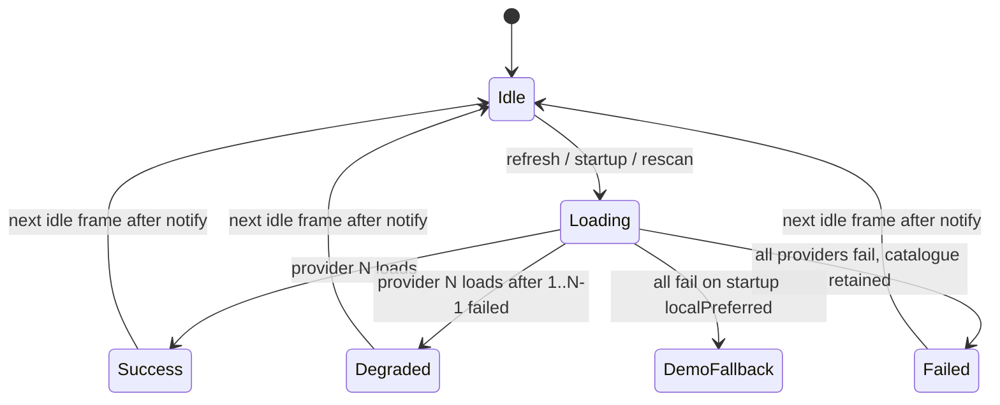

# M4 Phase 4.1 — Provider Management (Implementation Specification)

**Status:** Specification — **Accepted** (2026-07-12)  
**Milestone:** M4 — User Experience and Platform Integration  
**Branch:** `m4-development`  
**Development version:** `v0.5.0-dev`  
**Predecessor:** M3.5 complete — tag `m3.5-complete`

→ [M4 plan](./m4-plan.md#phase-41--provider-management)  
→ [Provider management architecture](../architecture/provider-management.md)  
→ [M3.5 Phase 4 plan](./m35-phase-4-plan.md) *(closed — do not reimplement)*  
→ [v0.5.0-dev release tracker](../release/v0.5.0-dev.md)

**ADRs (Accepted):**

- [ADR-001: Provider Health Model](../architecture/decisions/ADR-001-provider-health-model.md)
- [ADR-002: Provider Refresh Lifecycle](../architecture/decisions/ADR-002-provider-refresh-lifecycle.md)
- [ADR-003: Provider Status Presentation](../architecture/decisions/ADR-003-provider-status-presentation.md)

---

## Objective

Deliver a **user-facing provider management layer** on top of the M3.5 catalogue and media-access backend. Users must see which catalogue source is active, understand provider health, and refresh or retry without losing the last-good catalogue or restarting the app.

M4.1 is **visibility and interaction** — not a second network-client implementation.

---

## M3.5 baseline (already implemented — do not rebuild)

These capabilities are **complete and must remain unchanged in behaviour** unless an ADR explicitly approves a contract change:

| Layer | Component | What it does today |
|---|---|---|
| **Config** | `MediaProviderConfig` | Ordered catalogue providers (local paths, HTTPS URLs) + `MediaAccessConfig` |
| **Config** | `MediaProviderConfigService` | Persists config via `shared_preferences` |
| **Selection** | `CatalogueProviderSelector.orderedProviders()` | Builds attempt order: legacy local paths (localPreferred only) → configured providers; HTTP-only filter for `httpRequired` |
| **Load** | `CatalogService.loadOnStartup()` | Tries providers in order; demo fallback when all fail (localPreferred) |
| **Load** | `CatalogService.rescan()` | Re-runs provider chain; preserves catalogue on failure |
| **Load** | `CatalogService.loadFromFile()` / `loadFromUrl()` | Explicit manual loads |
| **Fallback** | Last-good catalogue | Failed reload does not replace working catalogue |
| **Fallback** | Demo catalogue | Used when all providers fail on startup (localPreferred) |
| **Errors** | `remote_fetch_errors.dart` | Readable TLS, timeout, network messages |
| **Security** | `remote_url_security.dart` | HTTPS preferred; plain HTTP warned/rejected per mode |
| **Media** | `MediaLocationResolver` | Maps catalogue paths → playable/artwork URIs |
| **Settings** | `MediaProviderSettingsScreen` | Edit local paths, HTTPS catalogue URL, media base URL, access mode |
| **UI** | `DashboardBanners` | Demo fallback banner, error banner with Retry → `rescan()` |
| **UI** | `StorageStatusSection` | Three-way chip: Live NAS / Fallback NAS / Demo; shows loaded path |
| **Scanner** | `ScannerService` | Runs indexer → `catalogService.rescan()` on success *(filesystem scan — separate from provider refresh)* |
| **Artwork** | `onCatalogReplaced` → `ArtworkService.clearCache()` | Sidecars rediscovered after catalogue reload *(2026-07-12)* |

### What M3.5 does **not** expose today

| Gap | M4.1 addresses |
|---|---|
| No structured per-provider health | ADR-001 health model |
| No record of which provider succeeded vs failed in a chain | ADR-001 attempt snapshot |
| `Retry` always re-runs full chain with no status detail | ADR-002 refresh lifecycle |
| Storage Status uses legacy three-way NAS/demo model, not configured providers | ADR-003 presentation |
| Settings and dashboard use different vocabulary | ADR-003 unified labels |
| No “last refreshed” / “active provider” in one place | Provider status panel |

---

## M4.1 deliverables (to implement after spec approval)

| # | Deliverable | Layer |
|---|---|---|
| 1 | `CatalogueProviderStatus` model + per-attempt result types | Service / model |
| 2 | `CatalogService` exposes active provider, last refresh, provider snapshot | Service |
| 3 | User-initiated **Refresh catalogue** with loading state (distinct from indexer scan) | Service + UI |
| 4 | **Provider Status** panel on dashboard (extends Storage Status) | UI |
| 5 | Dashboard banners aligned with health vocabulary | UI |
| 6 | Unit/widget tests per validation scenarios below | Test |
| 7 | Architecture doc → Accepted; ADRs → Accepted | Docs |

**Explicitly not in M4.1:** new provider types, auth, indexer changes, settings shell restructure (Phase 4.2), diagnostics screen (Phase 4.6).

---

## Proposed service contract (implementation target)

Introduce a read-only snapshot on `CatalogService` (names indicative):

```dart
/// Session snapshot — not persisted across app restarts (ADR-001).
CatalogueProviderSnapshot get providerSnapshot;

/// Provider that supplied the currently loaded catalogue, if known.
MediaCatalogueProviderDefinition? get activeCatalogueProvider;

/// When the active catalogue was last successfully replaced.
DateTime? get lastCatalogueLoadAt;
```

### Provider attempt lifecycle (`CatalogueProviderHealth`)

These values describe **per-provider attempt lifecycle and final outcome** for the most recent load cycle (ADR-001). They combine **transient** states (in-flight) and **settled** states (after the cycle completes).

| Value | Kind | Meaning |
|---|---|---|
| `idle` | Settled / initial | Not attempted in the current or any prior cycle this session, **or** not reached because an earlier provider in the chain succeeded (short-circuit) |
| `loading` | Transient | Attempt in progress for this provider |
| `success` | Settled | Active catalogue source; **first** provider to succeed in the chain for this cycle |
| `degraded` | Settled | Active catalogue source; succeeded **after** one or more earlier providers in the chain `failed` in the **same** cycle |
| `failed` | Settled | Attempted in this cycle and did not load the catalogue |
| `skipped` | Settled | **Never attempted** — excluded from the chain by configuration or selector rules (see below) |

**`degraded` applies when:**

1. The provider is the **active catalogue source** (`isActive`), and  
2. At least one **earlier** provider in `CatalogueProviderSelector` order was **attempted and failed** in the **same** load cycle, and  
3. Access mode is `localPreferred` (fallback chain semantics).  

It does **not** apply to manual single-source loads (`loadFromFile` / `loadFromUrl`) or when the first provider in order succeeds.

**`skipped` applies when:**

- **Configuration / selector exclusion only** — e.g. local file providers omitted under `httpRequired`.  

**`skipped` does not apply when:**

- A provider was bypassed because an **earlier provider succeeded** — those entries remain **`idle`** (not attempted this cycle).  
- A provider failed — use **`failed`**.  

### `CatalogueProviderSnapshot` field separation

The snapshot **separates concerns** as follows:

| Concern | Snapshot fields |
|---|---|
| **Configured provider identity** | Each `CatalogueProviderAttemptRecord.definition` (`MediaCatalogueProviderDefinition`); snapshot `accessMode` |
| **Attempt status** | Each record's `health` (`CatalogueProviderHealth`) |
| **Active catalogue source** | `activeProvider`, matching record `isActive`, `loadedCatalogueIdentity`, `catalogPath` (from existing `CatalogService`) |
| **Error / warning information** | Per-record `lastError`; snapshot-level `lastCycleError` (most recent chain failure); existing scan warnings unchanged |
| **Timestamps** | Per-record `lastAttemptAt`, `lastSuccessAt`; snapshot `lastLoadStartedAt`, `lastCatalogueLoadAt`, `sessionStartedAt` |
| **Fallback usage** | `isDemoFallback` (`isUsingFallback`), `isDegradedLoad` (active provider health is `degraded`), `demoActiveWithoutProvider` (demo with no matching config success) |

### Per-provider attempt record

Each entry in `snapshot.providers` (ordered like the last attempt chain):

| Field | Purpose |
|---|---|
| `definition` | Configured identity — local path or HTTPS URL |
| `health` | Attempt lifecycle / outcome (table above) |
| `lastError` | User-readable message when `failed`; null otherwise |
| `lastAttemptAt` | When this provider was last tried (null if never attempted) |
| `lastSuccessAt` | When this provider last loaded a catalogue (null if never) |
| `isActive` | True when this provider supplied the **current** catalogue (`success` or `degraded`) |

Selection order remains **`CatalogueProviderSelector`** — M4.1 records outcomes; it does not reorder unless a future ADR changes that.

### M3.5 behaviour preserved on refresh (ADR-002)

Catalogue refresh must **not** alter:

| Rule | Preserved behaviour |
|---|---|
| Provider ordering | `CatalogueProviderSelector.orderedProviders()` unchanged |
| `localPreferred` | Legacy locals prepended; full chain; demo when all fail on startup |
| `httpRequired` | HTTP providers only; no silent local attempts |
| Last-good catalogue | Failed refresh retains current `_catalog` |
| Demo fallback | Startup demo when all providers fail (`localPreferred`) |
| Artwork cache | `onCatalogReplaced` / `clearCache()` **only** after successful catalogue **replacement** — not on failure |

---

## UI behaviour (summary — detail in ADR-003)

### Provider Status panel (dashboard)

Replaces/evolves **Storage Status** with:

- **Active provider** — label + location (path or URL), health badge
- **Access mode** — `Local preferred` / `HTTPS required`
- **Last refreshed** — relative time from `lastCatalogueLoadAt`
- **Provider list** — each configured provider with health icon and last error (collapsed if success)
- **Actions:** `Refresh catalogue` · `Provider settings` (opens existing settings screen)

**Phase 4.1 vs Phase 4.6 boundary:** This panel shows **concise operational status** — active source, health badges, one-line errors, refresh/settings actions. It does **not** duplicate the future [Diagnostics screen](../architecture/diagnostics.md): resolver dump, TLS certificate detail, cache health, log export, and item counts remain **Phase 4.6**. Phase 4.1 may link “More diagnostics” when 4.6 ships.

### Dashboard banners

| Condition | Banner |
|---|---|
| Demo catalogue active (`isUsingFallback`) | Info — demo in use; Retry refresh |
| Refresh failed, catalogue retained | Error — readable message; Retry |
| Degraded (fallback provider active) | Warning — optional, dismissible — “Loaded from fallback source” |
| Scanner error | Unchanged — separate from provider refresh |

Banner **Retry** invokes provider refresh (ADR-002), **not** indexer scan. Full filesystem scan remains on dashboard AppBar / Library Manager.

### Settings screen

`MediaProviderSettingsScreen` remains the configuration editor. M4.1 adds:

- Link back to dashboard status (optional subtitle: “See dashboard for active source”)
- No duplicate refresh logic — save still updates config; user refreshes from dashboard or automatic next startup/rescan

---

## State transitions

See [ADR-001](../architecture/decisions/ADR-001-provider-health-model.md) for the health state machine.

High-level **session lifecycle:**

```
App start
  → loadOnStartup: providers → idle/loading → success | degraded | failed
  → failed all (localPreferred) → demo + failed snapshot

User: Refresh catalogue
  → all providers loading → success (replace catalogue) | failed (retain catalogue)

User: Run Full Scan (ScannerService)
  → indexer writes catalog.json → rescan() → same provider lifecycle

User: Save provider settings
  → config persisted → snapshot idle until next refresh/startup
```



---

## Validation scenarios

| # | Scenario | Expected behaviour |
|---|---|---|
| V1 | Local file loads first (localPreferred) | Active = local; health success; no degraded banner |
| V2 | Local missing, HTTPS succeeds | Active = HTTP; earlier locals failed; degraded warning optional |
| V3 | All providers fail, catalogue already loaded | Catalogue unchanged; error banner; snapshot all failed |
| V4 | All providers fail on cold start (localPreferred) | Demo catalogue; fallback banner; snapshot shows failures |
| V5 | httpRequired, HTTPS fails | No local attempts; error surfaced; no silent demo unless existing rule |
| V6 | User Refresh while loading | Button disabled; single in-flight refresh |
| V7 | Refresh success after adding sidecar | Catalogue replaced; artwork cache cleared (existing hook) |
| V8 | Legacy `catalog_path` pref + configured providers | Same order as M3.5; regression vs `provider_selection_test.dart` |
| V9 | Scanner full scan then rescan | Provider snapshot updates; active provider unchanged if same file |
| V10 | TLS failure on HTTPS | Readable certificate message in provider row + banner |

**Regression gate:** all existing `provider_selection_test.dart`, `catalog_service_http_test.dart`, and `catalog_service_artwork_cache_test.dart` tests pass unchanged unless intentionally extended.

---

## Definition of done

- [x] ADR-001, ADR-002, ADR-003 reviewed and **Accepted** (2026-07-12)
- [ ] `CatalogService` exposes provider snapshot without breaking existing public API
- [ ] Provider Status panel visible on dashboard with active provider and refresh action
- [ ] Refresh catalogue preserves last-good catalogue on failure
- [ ] M3.5 provider order and fallback semantics unchanged (V1–V8 pass)
- [ ] `flutter analyze` clean for touched files
- [ ] New unit tests for snapshot + refresh; widget smoke for status panel
- [ ] Windows smoke: local file, HTTPS catalogue, degraded fallback
- [ ] [provider-management.md](../architecture/provider-management.md) status → **Accepted**
- [ ] [v0.5.0-dev.md](../release/v0.5.0-dev.md) phase 4.1 table updated

---

## Documentation updates required before coding

| Document | Action |
|---|---|
| This spec | **Accepted** (2026-07-12) |
| ADR-001, ADR-002, ADR-003 | **Accepted** |
| [provider-management.md](../architecture/provider-management.md) | Spec merged; status → Accepted at **implementation** close |
| [m4-plan.md](./m4-plan.md) | Link this spec; set 4.1 → In progress when coding starts |
| [v0.5.0-dev.md](../release/v0.5.0-dev.md) | Phase status + validation checklist |
| [decisions/README.md](../architecture/decisions/README.md) | ADR index |

**Do not start implementation** until implementation kickoff is scheduled (spec and ADRs are accepted).

---

## Implementation order (when approved)

1. **Models** — `CatalogueProviderHealth`, attempt result, snapshot (pure Dart, tests first)
2. **CatalogService** — instrument `_tryProviderCatalogue`; expose snapshot getters
3. **Refresh** — explicit `refreshCatalogue()` alias/wrapper if needed for clarity (may equal `rescan()`)
4. **UI** — Provider Status panel; banner vocabulary
5. **Tests + Windows smoke**
6. **Doc closure** — ADRs Accepted, architecture Accepted

Estimated risk: **low** — backend exists; work is observability and UI.

---

## Out of scope (M4.1)

- New cloud provider types, OAuth, transcoding
- Multi-user profiles
- Indexer / `ScannerService` changes
- Settings framework restructure (Phase 4.2)
- Full diagnostics export (Phase 4.6)
- Persisting health history across app restarts

---

## Related documents

| Document | Purpose |
|---|---|
| [M3.5 media access complete](../release/m3.5-media-access-complete.md) | Validated deployment baseline |
| [Media access abstraction](../architecture/media-access-abstraction.md) | Resolver contract |
| [Settings planning](../architecture/settings.md) | Phase 4.2 follow-on |
| [Diagnostics planning](../architecture/diagnostics.md) | Phase 4.6 deep detail |
